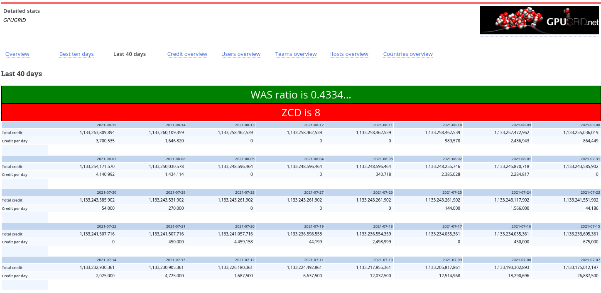

# Project-Whitelist-Checker
Checks if a BOINC project can be added to the Gridcoin whitelist (by stats requirements) or if a whitelisted project should be greylisted.

Use it by 
1. Go to either: 
    * the "last 40 days" stats for a project on [BOINCStats](https://www.boincstats.com/) 
    * a project on [BOINC Combined Statistics](https://boinc.netsoft-online.com/)
2. If using it it as bookmark, you will also need to click the bookmark when on that page (every time)

Note: this can only check zero credit days and work availability score. There are other
requirements that this cannot check

# Browser Extension

For Firefox users: you can install by going to [the addon store page for this extension here](https://addons.mozilla.org/en-US/firefox/addon/whitelist-requirement-checker/)

For Chrome users: you can either:
* use the userscript
* use the bookmark version 
* (not recommended in general for security reasons) clone/download this repo,  go to `chrome://extensions`, enable developer mode, and click load unpacked selecting the folder of the clone

# Userscript

1. Install tampermonkey. Instruction to install are available at <https://www.tampermonkey.net/>.
2. Once that's done, go to [this page](https://gist.github.com/RoboticMind/9329d339049628e1a6d1c8f22e910e5c/raw/6e993d9cea9787a77257b21daeb09b70ea9854e6/project-whitelist-check.user.js) and click install

# Bookmark

Go to the [bookmark_version.js file](bookmark_version.js) and copy it ([may be easier to copy from the raw file](https://raw.githubusercontent.com/RoboticMind/Project-Whitelist-Checker/main/bookmark_version.js)). Create a bookmark using that entire text as if it were a link. 

# Screenshots

## BOINCStats 

### Example Passing Both Checks

### Example Failing One Check

## BOINC Combined Statistics

### Example Passing Both Checks
